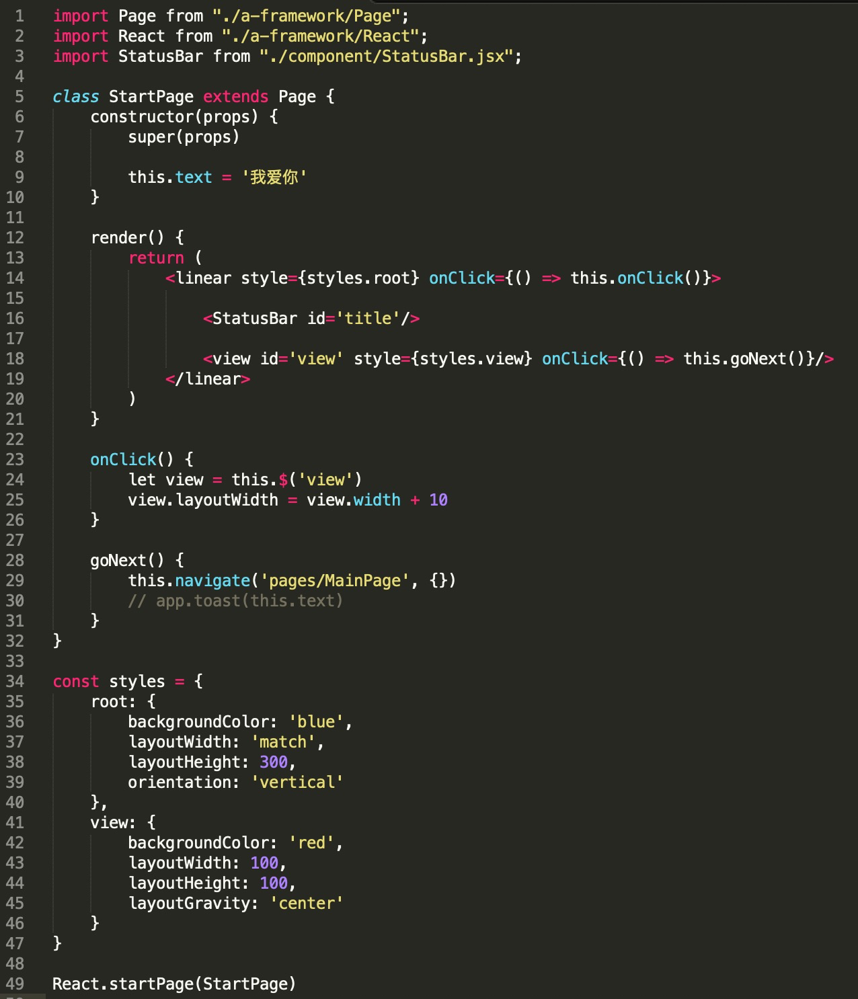
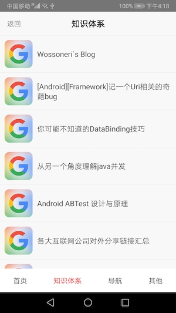

## Orange
使用[j2v8](https://github.com/eclipsesource/J2V8)实现的一种动态UI组件化框架，
使用js编写页面和业务逻辑，支持动态发布和热更新。浏览方式和浏览器非常相似。
非常适合业务的快速迭代和问题修复

##### 1. 动态UI容器
动态UI容器是一个Layout，包括js执行环境和承载UI视图。js执行中创建的view将挂载在容器之中。一个容器对应有一个js线程，
容器loadUrl来加载一个js文件，并使用js解释器执行js代码。一个js文件被认为是一个页面，同时容器控制着页面的生命周期。

##### 2. JS线程
JS线程包含js的解释器[j2v8](https://github.com/eclipsesource/J2V8)，同时包含着各种执行环境，是一个消息循环线程。
环境主要有：
    - app
    - ui
    - storage
    - http
    - page
    - timer
    - page
    
##### 3. 布局系统
布局方式直接集成于Android系统的原生布局方式，如linearLayout, frameLayout, layoutWidth,layoutGravity等等

##### 4. 页面Page
 一个Page代表一个页面，是一个JS文件，拥有完整的生命周期。其承载着整个视图树，同时集成这业务逻辑。Page由多个组件构成。
- onReady  页面视图渲染完毕
- onShow   页面展示
- onHide    页面隐藏
- onClose   页面销毁
 
##### 5. 组件Component
 js端的开发模式主要是组件化，一个页面由多个组件构成，组件又由原始视图构成。一个组件可以在不同的页面中使用，
 最终打包到不同的js文件中去。
 
- UserDetailPage.jsx
    - TitleBarComponent.jsx
    - UserBaseInfoComponent.jsx
        - linearLayout
            - textView
            - textView
        - imageView
    - UserArticlesComponent.jsx
        - headerView
        - listView
        - footerView

##### 6. 原始视图
对应于Android本身的视图，由组合的属性确定视图的展示样式，
如layoutWidth，gravity，backgroundColor，text，onClick

效果展示 
 

主要技术：[javascript] [jsx] [j2v8] [android]